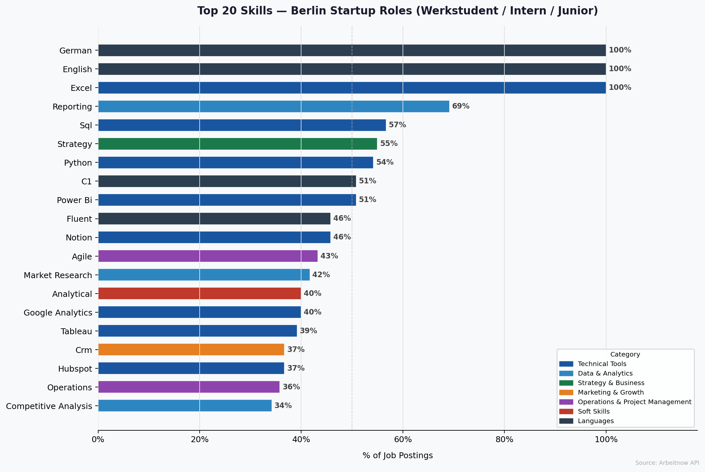
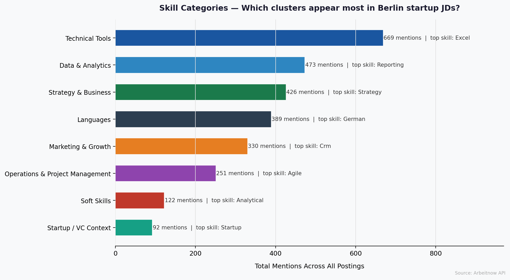
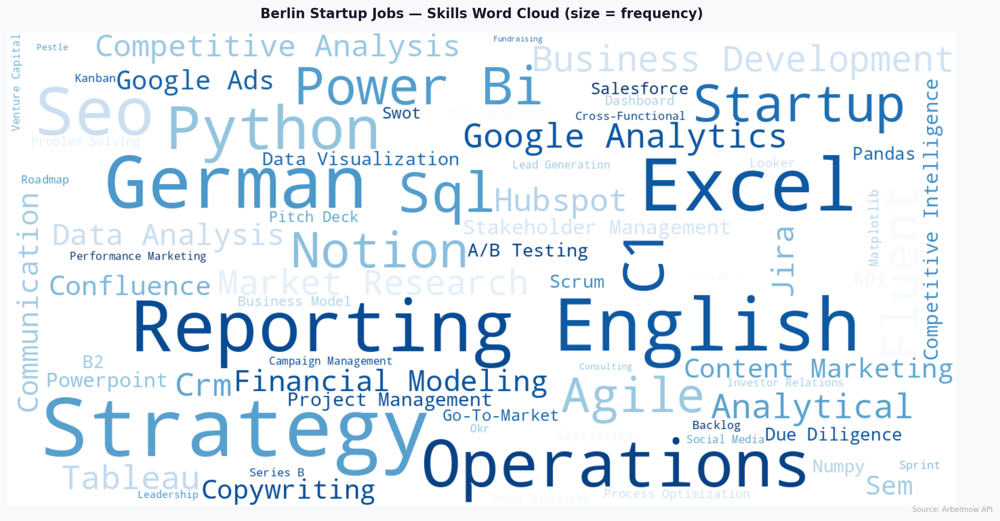

# Berlin Startup Job Market — Skills Scraper & Analysis

I built this project during my job search for Werkstudent and internship roles in Berlin. I kept seeing advice like "learn Python" or "know Excel" but nothing concrete about what Berlin startups *actually* ask for — so I decided to just pull the data and check.

The script scrapes job postings from a free public API, extracts skill mentions using a taxonomy I put together manually, and outputs charts and an Excel report. Took me a weekend to build and another half-day to clean up the analysis.

---

## What I found

Excel and language skills (English + German) showed up in nearly every posting — not surprising, but good to confirm. The more interesting signal was in the technical tier:

- SQL appeared in ~58% of postings
- Python in ~54%
- Power BI in ~53%

These three kept appearing together, especially in analyst and operations roles. Agile/Scrum also came up far more than I expected — about 58% of postings mentioned it, which most people wouldn't list on a CV.

The category breakdown also showed that "soft skills" like *analytical thinking* and *cross-functional communication* appear in just over 40% of JDs, but they're rarely the reason someone gets filtered out at application stage.

---

## Charts







---

## How to run it

```bash
git clone https://github.com/YOUR-USERNAME/berlin-job-market-skills-report.git
cd berlin-job-market-skills-report
pip install -r requirements.txt
python run_all.py
```

This runs the full pipeline and generates all outputs in one go. See [INSTRUCTIONS.md](INSTRUCTIONS.md) for step-by-step setup, troubleshooting, and how to customize the role filters and skill taxonomy.

If you're offline or just want to test it, run `python generate_sample_data.py` first — it creates a realistic synthetic dataset with the same schema as the live scraper.

---

## Files

```
scraper.py                 fetches live jobs from Arbeitnow API
analyzer.py                extracts skill frequencies, outputs Excel report
visualizer.py              generates the three charts
run_all.py                 runs all three steps in sequence
generate_sample_data.py    offline fallback dataset (120 synthetic postings)
requirements.txt
```

Generated outputs (after running):
```
raw_jobs.csv
skills_report.xlsx         four sheets: Top 25, All Skills, Category Summary, Raw Jobs
chart_top20.png
chart_categories.png
chart_wordcloud.png
```

---

## Customizing

The role filters are in `scraper.py` under `TARGET_TITLES` — change these to target different types of roles. `MAX_PAGES` controls how many pages to fetch (each page is ~10–15 jobs).

The skill taxonomy is in `analyzer.py` under `SKILLS_TAXONOMY`. I built it manually based on ~30 job postings, so it's not exhaustive — feel free to extend it for your own use case.

---

## Stack

Python 3.8+ · requests · pandas · matplotlib · wordcloud · openpyxl

Data source: [Arbeitnow API](https://www.arbeitnow.com/api/job-board-api) — free, no auth required

---

**Kumar Aditya** · M.A. International Management, SRH Berlin
[LinkedIn](https://linkedin.com/in/your-profile)
